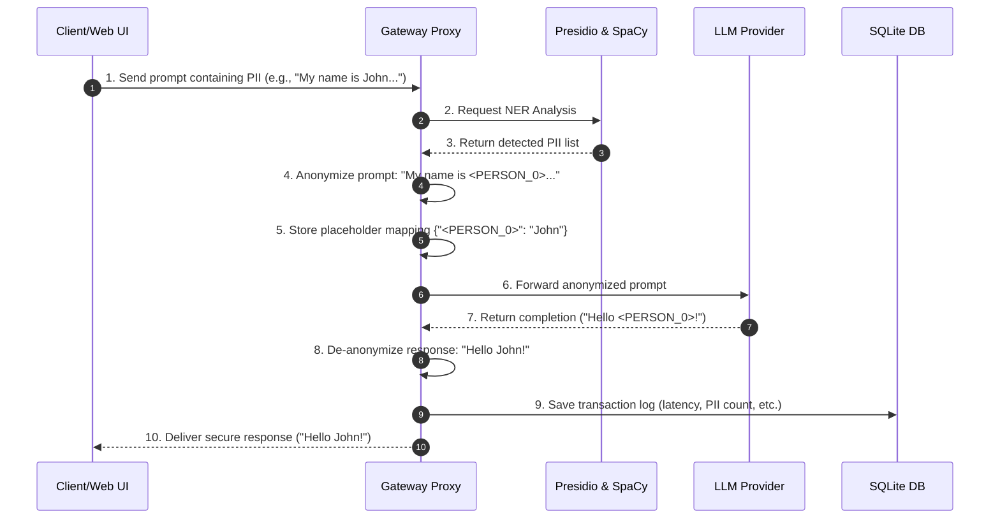

# DSGVO Privacy Gateway for LLMs (v0.1)

A FastAPI-based, privacy-compliant proxy gateway that detects and masks Personally Identifiable Information (PII) in prompts before they are sent to public LLM APIs (like OpenAI, Anthropic, Mistral, Google Gemini, or OpenRouter), and automatically de-anonymizes the responses on the way back.

Developed using **Python**, **FastAPI**, **Microsoft Presidio**, and **SpaCy** (with full English & German Named Entity Recognition).

---

## Key Features

* **Bi-directional PII Mapping**: Dynamically replaces sensitive information with index-based placeholders (e.g., `<PERSON_0>`, `<EMAIL_ADDRESS_0>`) when forwarding prompts, and restores the original values when delivering the response to the user.
* **Predefined & Custom German Recognizers**: Out-of-the-box support for standard PII (Names, Emails, Phone Numbers, IP Addresses, Credit Cards, Locations) and custom German identifiers:
  * **German Tax ID** (Steueridentifikationsnummer)
  * **German Tax Number** (Steuernummer)
  * **German Vehicle License Plates** (Kfz-Kennzeichen)
  * **German Identity Card Numbers** (Personalausweisnummer)
  * **German Phone Numbers** (targeted local formatting)
  * **German/International IBANs**
* **Drop-in OpenAI Compatibility**: Exposes a `/v1/chat/completions` endpoint. Switch your existing application's base URL to this gateway, and it instantly works without changing your LLM integration code.
* **Multi-Provider Payload Translation**: Automatically translates standard OpenAI request bodies into native payloads for **Anthropic Claude**, **Google Gemini**, and **OpenRouter** APIs.
* **Dynamic Model Routing (e.g. for n8n)**:
  * Route requests to specific providers dynamically by entering the model in the format `provider/modellname` (e.g., `anthropic/claude-3-5-sonnet` or `openai/gpt-4o`).
  * The gateway parses the request, extracts the provider and model, loads the appropriate API key from the vault, translates the API structure, anonymizes the prompt, and forwards the call.
  * Includes automatic fallback detection using prefixes (e.g. `gpt-`, `claude-`, `gemini-`, `mistral-`).
* **Performance & Context Tuning**:
  * **Text Segmentation (Chunking)**: Automatically splits very large inputs into overlapping chunks for PII analysis to prevent SpaCy performance bottlenecks and Out-Of-Memory (OOM) errors. Fully toggleable with customizable chunk sizes.
  * **Sliding Window Context Protection**: Prevents exceeding the LLM context window limits by dropping the oldest messages from history when the estimated token count exceeds the configured limit, while always protecting the original system prompt.
* **Local, Secure DSGVO-Compliant RAG**:
  * Upload document text files (or customer tables). The gateway chunks them, anonymizes them locally, and stores the encrypted raw mapping inside a local SQLite database.
  * Ask questions: The system anonymizes your query, performs a keyword-based search on the anonymized chunks, builds a secure prompt, queries the LLM, and deanonymizes the output back to the client.
* **Enterprise Extensions**:
  * **Custom Whitelist & Blacklist**: Define allowed exceptions (Whitelist) that are never masked, or custom sensitive terms (Blacklist) that are always masked.
  * **Multiple Masking Strategies**: Choose how each PII category is masked (Placeholder, Redact, MD5 Hash, or Faker/Synthetic data).
  * **Symmetric API Key Vault**: Manage external credentials securely. Keys are encrypted using **Fernet** (AES-128 in CBC mode) with a local key file (`.gateway_secret.key`) and are masked as `********` in the Dashboard UI.
  * **Safe-Logging Compliance Mode**: Redacts all prompt and response contents from SQLite logs, keeping only safe metadata.
* **Sleek Glassmorphic Web Dashboard**:
  * **Interactive Playground**: Test prompts, view live highlights with color-coded entity badges, compare masked payloads, and inspect final deanonymized completions.
  * **Configuration Panel**: Toggle PII categories, change masking strategies, adjust thresholds, configure Whitelists/Blacklists, manage API vaults, and fine-tune Chunking/Sliding Window parameters.
  * **Audit Log Trail**: Monitor request metrics, latency, and privacy scores.

---

## Architecture & Data Flow

The gateway acts as an intelligent middleware proxy intercepting communication between the client and public LLM providers.



---

## Quick Start

### 1. Requirements
Ensure you have **Python 3.10+** installed on your system.

### 2. Run the Server
The repository includes a helper startup script `run.py` that automates virtual environment creation, package installation, and SpaCy model downloads (`en_core_web_sm` and `de_core_news_sm`).

Simply run:
```bash
python run.py
```

### 3. Open the Dashboard
Once the server starts up, open your browser and navigate to:
**[http://localhost:8000](http://localhost:8000)**

*For a full visual demonstration and screenshots of the Dashboard, Playground, and Settings, see the [walkthrough.md](file:///C:/Users/ottos/.gemini/antigravity-ide/brain/fecd8c31-8f7d-4c71-a7e3-cfab4789c61f/walkthrough.md).*

---

## API Integration

You can direct any standard LLM client directly to the gateway.

### Python OpenAI SDK (Direct Proxy)
```python
from openai import OpenAI

# Initialize client pointing to local DSGVO Privacy Gateway
client = OpenAI(
    base_url="http://localhost:8000/v1",
    api_key="your-openai-api-key" # API key is passed securely to OpenAI
)

response = client.chat.completions.create(
    model="gpt-4o",
    messages=[
        {"role": "user", "content": "Rückmeldung für Herrn Max Mustermann (max.mustermann@mail.de) senden."}
    ]
)

print(response.choices[0].message.content)
# Output: "Hallo Herr Max Mustermann, wir haben Ihre Email max.mustermann@mail.de erhalten."
# Note: The external LLM only processed: "Rückmeldung für Herrn <PERSON_0> (<EMAIL_ADDRESS_0>) senden."
```

### Python OpenAI SDK (Dynamic Routing)
```python
from openai import OpenAI

client = OpenAI(
    base_url="http://localhost:8000/v1",
    api_key="ignored-or-dummy-key" # The gateway loads the correct key from the vault
)

# Route to Anthropic dynamically using the slash format
response = client.chat.completions.create(
    model="anthropic/claude-3-5-sonnet",
    messages=[
        {"role": "user", "content": "Bitte antworte Herrn Max Mustermann unter max@muster.de."}
    ]
)

print(response.choices[0].message.content)
```

### cURL
```bash
curl http://localhost:8000/v1/chat/completions \
  -H "Content-Type: application/json" \
  -d '{
    "model": "anthropic/claude-3-5-sonnet",
    "messages": [
      {"role": "user", "content": "Contact Christian Schmidt at +49 170 1234567."}
    ]
  }'
```

---

## Testing

We have built a comprehensive test suite using `pytest`.

To run the automated unit and integration tests, run:
```bash
.\venv\Scripts\python -m pytest tests/
```

---

## Business Value for Enterprises (Mehrwert für Unternehmen)

Deploying a local **DSGVO Privacy Gateway** provides critical strategic and operational advantages for modern, data-driven organizations:

### 1. Absolute GDPR Compliance & Legal Security (DSGVO-Konformität)
Under European GDPR law, transmitting Personally Identifiable Information (PII) of employees, customers, or partners to external US-hosted LLMs without strict protection violates data privacy regulations, exposing companies to multi-million Euro fines. The Gateway sanitizes all payloads **locally** before they leave corporate boundaries, turning public LLM usage legally compliant overnight.

### 2. Safeguarding Proprietary IP & Client Data
Prevents accidental leaks of proprietary source codes, internal project codenames, financial data, and sensitive client details. Employees can safely utilize LLMs for drafts, summarizations, or coding support without risking the company's intellectual property.

### 3. Zero Developer Friction & High Adoption
Because the Gateway mimics the standard OpenAI API structure, it acts as a **drop-in proxy**. Developers can secure existing AI agents, corporate chatbots, or internal analysis pipelines simply by changing a single configuration line (`base_url`), requiring no rewrite of core business logic.

### 4. Independence & Provider Flexibility (No Vendor Lock-In)
The Gateway abstracts the underlying LLM provider. Since it dynamically translates request structures, companies can switch their backend LLM from OpenAI to Anthropic Claude, Google Gemini, OpenRouter, or local models without modifying their consumer applications.

### 5. Audit Trail & Governance Reporting
All transactions are logged locally in a secure SQLite database. Compliance officers and IT administrators can audit exactly which types of PII were blocked, check model latencies, evaluate privacy scores, and produce clear security reports to verify compliance during external audits.
