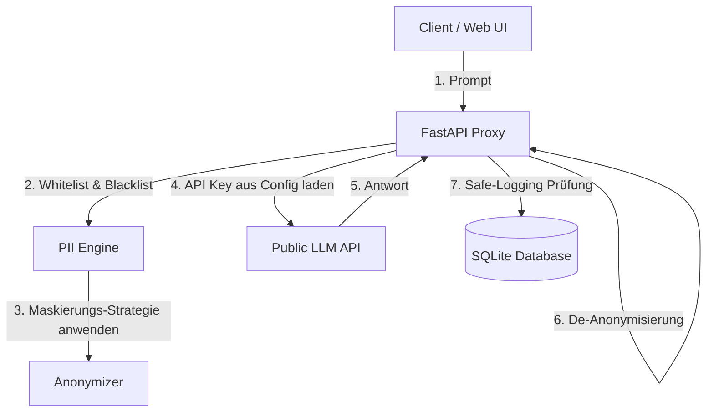

# Implementation Plan - DSGVO Privacy Gateway Erweiterung (V2)

Dieses Dokument beschreibt die geplante Erweiterung des **DSGVO Privacy Gateway** um vier neue Enterprise-Funktionen:
1. **Whitelist & Blacklist** (Eigene Ausnahmen und Sperrbegriffe)
2. **Kategorie-spezifische Maskierungs-Strategien** (Platzhalter, Schwärzung, Hashing, Synthetische Faker-Daten)
3. **API-Schlüsselverwaltung im Web-Dashboard** (Vermeidung von `.env`-Konfigurationen)
4. **Compliance-Logging** (Sicherer Modus ohne Speicherung sensibler Payload-Texte)

---

## 1. Architektur-Erweiterung

Die neuen Funktionen greifen tief in den Datenfluss und das Konfigurationssystem ein:

---

## 2. User Review Required

> [!IMPORTANT]
> **Einschränkung bei Hashing & Schwärzung**
> Wenn für eine Kategorie (z. B. `EMAIL_ADDRESS`) als Strategie **Schwärzung** (Redact) oder **Hashing** gewählt wird, ist eine De-Anonymisierung der Antwort im Rückkanal für diese Begriffe technisch nicht mehr möglich, da kein rückübersetzbarer Wert gespeichert wird. Die UI wird den Nutzer mit Hinweistexten darauf aufmerksam machen.

---

## 3. Offene Detailfragen

> [!NOTE]
> 1. **Verschlüsselung der API-Keys**: Sollen die im Dashboard eingegebenen API-Schlüssel im Klartext in der Konfigurationsdatei `gateway_config.json` gespeichert werden (ausreichend für lokale Demos), oder sollen wir eine einfache symmetrische Verschlüsselung (z. B. Base64-Obfuscation oder XOR) nutzen, um versehentliches Mitlesen zu verhindern? (Vorschlag: Base64-Obfuscation für eine einfache Demo).

---

## 4. Proposed Changes

Wir planen die Anpassung der folgenden Dateien:

---

### Backend Foundation & Configuration

#### [MODIFY] [src/config.py](file:///c:/Users/ottos/OneDrive/Desktop/DSGVO%20Proxy/src/config.py)
Erweiterung der Standardwerte:
- `whitelist`: Liste von Begriffen, die nicht maskiert werden dürfen.
- `blacklist`: Liste von Begriffen, die immer maskiert werden sollen.
- `entity_strategies`: Mapping von Entitäten zu ihren Strategien (Default: `"placeholder"`).
- `api_keys`: Speicherung der API-Keys für OpenAI, Anthropic, Mistral, Gemini.
- `safe_logging_mode`: Boolescher Wert für den Compliance-Log-Modus.

#### [MODIFY] [src/models.py](file:///c:/Users/ottos/OneDrive/Desktop/DSGVO%20Proxy/src/models.py)
Anpassung der Pydantic-Modelle:
- `ConfigUpdate` und `GatewayConfig` erhalten neue Felder für Whitelist, Blacklist, API Keys, Safe-Logging und Strategien.
- `AuditLogItem` wird angepasst, so dass `entities_details` als `List[Dict[str, Any]]` anstelle von `str` typisiert ist, um einen `ResponseValidationError` beim Auslesen der Logs über die API zu vermeiden.

---

### PII & Proxy Logic

#### [MODIFY] [src/pii_engine.py](file:///c:/Users/ottos/OneDrive/Desktop/DSGVO%20Proxy/src/pii_engine.py)
- **Whitelist/Blacklist-Filterung**:
  - In `analyze()`: Suche nach Blacklist-Wörtern im Text und Einfügen als PII-Entitäten. Filtern der Presidio-Ergebnisse, um Whitelist-Wörter zu ignorieren.
- **Strategie-Erweiterung**:
  - In `anonymize()`: Liest die Strategie für den Entitätstyp.
    - `"placeholder"`: Indexierter Platzhalter `<PERSON_0>` (standard).
    - `"redact"`: Ersetzt durch `[REDACTED]`.
    - `"hash"`: Ersetzt durch ein Hash-Kürzel (z. B. `[HASH-8a9d]`).
    - `"faker"`: Ersetzt durch realistische Fake-Daten aus einem statischen Wörterbuch (z. B. "Max Müller" für Namen, "musterstadt@mail.de" für E-Mail, "Musterhausen" für Orte).

#### [MODIFY] [src/gateway.py](file:///c:/Users/ottos/OneDrive/Desktop/DSGVO%20Proxy/src/gateway.py)
- Dynamische API-Key Auflösung: Prüft zuerst die im Gateway-Dashboard hinterlegten API-Keys und fällt nur bei deren Abwesenheit auf `.env`-Variablen zurück.

---

### Database & Logging

#### [MODIFY] [src/utils/logger.py](file:///c:/Users/ottos/OneDrive/Desktop/DSGVO%20Proxy/src/utils/logger.py)
- In `log_request()`: Auslesen der aktuellen Gateway-Konfiguration. Wenn `safe_logging_mode` aktiv ist, werden die Spalten `original_prompt`, `anonymized_prompt`, `llm_response` und `deanonymized_response` durch Redaktions-Texte (z. B. `[REDACTED FOR COMPLIANCE]`) ersetzt, bevor sie in der SQLite-Datenbank gespeichert werden. Metadaten (Latenz, Anzahl Entities) bleiben lesbar.

#### [MODIFY] [src/main.py](file:///c:/Users/ottos/OneDrive/Desktop/DSGVO%20Proxy/src/main.py)
- Ergänzung der API-Endpunkte zur Übergabe der neuen Konfigurationsfelder.

---

### Web Dashboard (Sleek UI Extensions)

#### [MODIFY] [src/static/index.html](file:///c:/Users/ottos/OneDrive/Desktop/DSGVO%20Proxy/src/static/index.html)
- **Settings View**:
  - Hinzufügen von Eingabebereichen für Whitelist (Kommagetrennt) und Blacklist (Kommagetrennt).
  - Hinzufügen von Passwort-Eingabefeldern für LLM API-Keys (OpenAI, Anthropic, Mistral, Gemini).
  - Hinzufügen der Checkbox für "Safe-Logging-Modus".
  - Hinzufügen von Dropdowns neben jeder PII-Kategorie im rechten Panel, um die Strategie (Placeholder, Redact, Hash, Faker) auszuwählen.

#### [MODIFY] [src/static/app.css](file:///c:/Users/ottos/OneDrive/Desktop/DSGVO%20Proxy/src/static/app.css)
- Styling für die neuen Formularelemente (Strategie-Dropdowns, API-Key-Sektion, Whitelist/Blacklist-Textfelder).

#### [MODIFY] [src/static/app.js](file:///c:/Users/ottos/OneDrive/Desktop/DSGVO%20Proxy/src/static/app.js)
- Auslesen und Speichern der neuen Parameter.
- Dynamische Anpassung der Code-Snippets in der API-Dokumentation (z. B. automatisches Ausblenden des API-Keys für cURL-Beispiele, falls hinterlegt).

---

## 5. Verifikations-Plan

### Automatisierte Tests
Erweiterung von `tests/test_pii_engine.py` und `tests/test_api.py` zur Validierung:
- Whitelist filtert Namen heraus.
- Blacklist maskiert benutzerdefinierte Wörter.
- Strategien (Hash, Redact, Faker) werden korrekt angewendet.
- Safe-Logging maskiert die Payload-Texte in der SQLite-Datenbank.

### Manuelle Verifikation
- Manuelle Prüfung im Dashboard: Aktivieren von Safe-Logging, Senden einer Anfrage, Verifizieren in der Logs-Tabelle, dass die Prompt-Texte nicht in der Tabelle/Modal sichtbar sind.
- Auswählen der Strategie "Faker" für Namen, Verifizieren des anonymisierten Prompts im Playground (z. B. *"Hallo Max Müller..."* statt Platzhalter).
